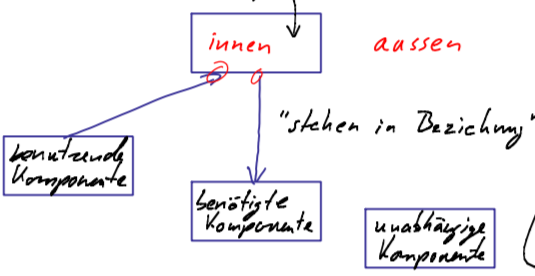
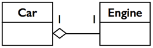
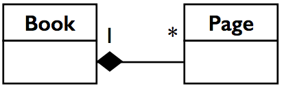
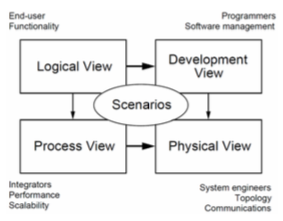
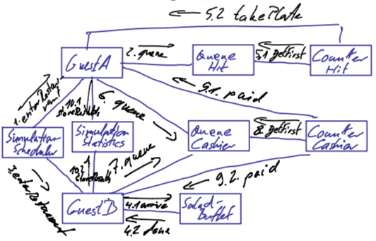

## Software Architecture
Persönliche Zusammenfassung der Vorlesung SWA FS 2018.

### Definition

Was genau unter der Disziplin Software Architektur verstanden wird ist nicht abschliessend definiert, es gibt verschiedene Sichtweisen welche folgend kurz zusammengefasst werden.  

* Architektur liefert Baupläne für Software. Diese werden so gemacht, dass deren Einhaltung zur Erreichung der relevanten Qualität führt. Baupläne helfen zudem den Entwicklungsprozess  zu organisieren.
* Architektur ist das Gesamtbild (Qualität), das alle Team-Mitglieder verbindet. Individuelle Entscheidungen der Mitglieder sind im Rahmen dieses Gesamtbildes möglich.
* Die Struktur der Architektur, ihre Komponenten und Beziehungen müssen auch im Code auffindbar sein.

### Erarbeitung / Ablauf

1. Ziele, Anforderungen und Qualitätsansprüche werden definieren
2. Entwurf der Architektur wird erarbeitet
3. Führt zu Lösungs-Strategien, grober Aufbau
4. Architektur wird umgesetzt
5. Führt zu Source-Code

### Nutzen

Software-Architektur heisst, über den Aufbau eines Systems nachzudenken ohne direkt detaillierten Source-Code zu schreiben. Es geht also im wesentlichen darum, Details zu abstrahieren und sich auf gröbere Strukturen zu konzentrieren. Konkret:

* **Schnittstellen**. Sollte man verstehen ohne die Implementation lesen zu müssen. Ermöglicht Arbeitsteilung im Team aber auch darüber hinaus. 
* **Einarbeitung**. Einfacher Zugang für neue Mitarbeiter (Top-Down). Heisst, welche Teile des Ganzen müssen im Detail verstanden werden?
* **Aufwandschätzungen**. Grosse Systeme/Aufgaben als Summe einzelner überschaubarer Teile ansehen. Schätzungen werden einfacher.
* **Qualität sichern**. Einhalten von Design-Patterns oder sonstigen Vorgaben.

### Box-and-Arrows

Software-Architektur bedeutet in den meisten Fällen, den Aufbau eines Systems aus mehreren **Komponenten** (*Components*) und deren **Interaktionen** (*Interactions*) zu beschreiben. Die Abstraktion als Box lässt offen wie diese im Inneren genau funktioniert. Beziehungen zwischen Komponenten lassen sich illustrieren - welche verwendet, benötigt welche? Welche sind gänzlich unabhängig? Solche Diagramme repräsentieren in der Regel Teilbereiche aus einer bestimmten Sichtweise (*View*). Um die gesammte Architektur verstehen zu können müssen meist mehrere Sichten betrachtet werden.  

#### Beziehungstypen

Neben den üblichen Pfeiltypen wie Inheritance, Implementing oder Beziehung existieren:

* **Aggregation** "ist Teil von"  
 
  
  
* **Composition** "besteht aus"

  

### Sichten (*Views*)

In der Software-Architektur haben sich folgende Sichten etabliert.  

#### Development View

Klassen sind Artefakte welche in der Regel durch einen Entwickler hergestellt werden. Daraus entstehende Diagramme (*Klassendiagramme*) gehören deswegen zur Development View.

* .class Files zur erstellung von Objekten
* Source-Dateien die durch den Entwickler hergestellt wurden

#### Logical View

Die Logical View beschäftigt sich mit den zur Laufzeit existierenden Strukturen. In der objektorientierten Programmierung wären dies Objekte. Betrachten man sehr kleine Systeme, so wären Objekte die Komponenten. Beziehungen zwischen diesen Objekten sind die Abhängigkeiten sowie der gegenseitige Aufruf von Operationen.

* Ein Software-System soll eine bestimmte Wirkung erzielen.
* Diese entsteht durch das Verhalten von Objekten und deren Interaktion.
* Der Computer selber enthält eine Objekt-Fabrik (*ClassLoader*) mit welchem neue Instanzen zur Laufzeit erstellt werden.

#### Low Representational Gap (LRG)

Die Kluft zwischen der Darstellung realer Dinge soll über alle Representations-Schichten möglichst minimal gehalten weren. Das *LRG* verlangt also im ersten Schritt die reale Welt in einem objektorientierten Modell abzubilden. Das entstandene Modell wird danach bestmöglich 1:1 in Software übertragen. Folgende Vorteile entstehen:

* Objekte und deren Zustände entsprechen möglichst realen Dingen
* Letztlich gibt es nur ein minimales Gap zwischen Real und Software
* Strukturen können einfacher verstanden werden (neue Mitarbeiter) 

### Domain Driven Design (DDD)

Ist eine Arbeitsmethode um unter anderem das Ziel des *LRG* zu erreichen. Der Entwurf ist getrieben durch die Anwendungs-Domäne. Reale Dinge werden als *Entitäten* erfasst, sammt deren Eigenschaften und Abhängigkeiten. Entitäten bilden dann unmittelbar *Komponenten* die sich in Software abbilden lassen.

#### Operationen Logical View

Fast jedes System benötigt bestimmte Abläufe zwischen dessen *Komponenten* um überhaupt funktionieren zu können. Pro *Komponente* könnte jede Operation gelistet werden die sinvoll erscheint bzw. grade einfällt. Dieses vorgehen wäre **Entitäten getrieben**, würde jedoch nur für sehr einfache Systeme Sinn machen bzw. nutzbar sein. Bei komplexen Systemen ist es wesentlich sinvoller nur jene Operationen zu definieren welche auch für das ausführen bestimmter Szenarien (**Szenarien getrieben**) notwendig sind.

#### Linguistisches Vorgehensmodell

Mit folgender Methode können Szenarien zur DDD-Modellen abgebildet werden. Dieses sollte aber sehr **vorsichtig** angewendet werden, Ausnahmen immer möglich!

* Nach Nomen suchen, Objekte daraus bilden
* Nach Verben suchen, Operationen daraus bilden

#### Communication Diagrams

UML Darstellungsmöglichkeit für ein sogn. Kommunikationsdiagram.  
**Tipp**: Szenario Nummer (z.B. 5.2) jeweils notieren.

## Entwurf in Arbeitsteilung umsetzen

#### Objektorientierte Analyse (OOA)

Analyse sowie modellierung der realen Welt (DDD / LRG) zur Analyse der notwentigen Objekte. Aus dieser OOA wird das OOD entwickelt.

#### Objektorientiertes Design (OOD)

Im OOD werden zusätzlich Aufgaben betrachtet welche in der realen Welt eigentlich nicht vorkommen, für die Umsetzung der Software aber notwendig sind. Ziel ist in der Logical View zu verstehen, welche Objekte zur Laufzeit der Software die relevante Wirkung erzeugen und wie diese Objekte dafür zusammenarbeiten.

#### Von Objekten zu Klassen (Development View)

Aus den Objekten der Logical View können die benötigten Klassen abgeleitet werden. Beziehungen benötigen dabei Instanzvariabeln, Interaktionen öffentliche Methoden. Ziel ist die gerade benötigten Klassen zu implementieren welche für das Szenario nötig sind - die Development View enthält nur jene Klassen die auch Architektur-relevant sind (z.B. Klassen hinter einer Facade/Factory nicht relevant).

#### Methodisches Vorgehen

1. Liste aller zu programmierenden Klassen erstellen, so dass:  
	- jedes Objekt von genau einer Klasse instanziert werden kann
	- gleichartige Objekte mit identischem Verhalten von derselben Klasse instanziert werden
	- jede Klasse mind. eines der benötigen Objekte instanziert.  
	**=> Objekte den Klassen zuordnen**
	
2. Für jeden eingehenden Pfeil, welcher eine Interaktion darstellt, wird eine entsprechende public Methode vorgesehen.  
	**Ergebnis:** vollständige Methoden-Signatur inkl. Rückgabewert und Parametern sowie zusätzlichen Informationen zum Verhalten.
	
3. Die so erstellten Grundgerüste können nun unabhängig ausprogrammiert und anschliessend zusammengefügt werden.

#### Learnings

- Paralleles Arbeiten ist deutlich schneller (time to market).
- Schnittstellen müssen genügend präzise definiert sein   
  **=>** Signatur, Parameter, Rückgabewerte, Naming, Verhalten (JavaDoc).
- Fehler in Klassen fallen erst bei Integration auf.
- Innerhalb der Klasse hat der Entwickler viel Freiheit (z.B. für Architektur nicht relevante Entscheide)
- Dokumentation der Architektur sowie dessen Verständnis helfen bei der Einarbeitung, um Code gezielt ändern zu können.

## SOLID Prinzipien

Folgende Entwurfsmuster haben zum Ziel - wartbare, flexible und verständliche Software zu produzieren.

#### Wiederverwendbarkeit

Die Entstehung von objektorientierten Programmiersprachen wie Java ist auf das Bedürfnis, die reale Welt abzubilden sowie Komponenten wieder zu verwenden (Änderbarkeit/Erweiterbarkeit), zurückzuführen. Es gibt verschiedene Arten wie Komponenten wiederverwendet werden können.

1. Vorhandene Klassen werden gemeinsam mit neuen Klassen verwendet.
2. Vorhandene Klassen werden verwendet um neue Objekte (z.B. neue Ausprägungen wie Buffet -> SuppenBuffet) zu instanzieren. 
3. Neue Klassen werden von vorhanden abgeleitet und überschreiben Notwendiges.

Die Möglichkeit des Erweiterns bzw. Anpassens kann jedoch schnell zu unübersichtlichen Systemen führen. Aus solchen Erfahrungen haben sich Entwurfsmuster entwickelt welche versuchen Chaos zu verhindern.

#### Single Responsibility Principle

*Jede Klasse hat genau eine Verantwortung, d.h. nur eine Art von Änderungen in der Spezifikation soll die Klasse betreffen können.*

Ein Objekt bzw. eine Klasse welche mehr als eine Aufgabe übernimmt, muss immer dann angepasst werden, wenn eine der Aufgaben ändert. Hier besteht die Gefahr, dass sich Änderungen an einer Aufgabe aus Versehen auch auf einen anderen Aufgabenbereich auswirken. Speziell in Fällen, in welchen alte und neue Implementationen von Aufgaben weiter existieren, entstehen enorm viele mögliche Kombinationen. Sind Verantwortungen hingegen über mehrere Objekte/Klassen aufgeteilt, so stellt dies eine klare Abgrenzung der Zuständigkeit dar. Anpassungen an einer Aufgabe ändern so in der Regel auch nur das Verhalten der Zuständigen Klasse (grade mittels privater Sichtbarkeit von Ausprägungen).

**Verantwortungen notieren**  

Werden Verantwortungen eines Objekts beschrieben, immer klar und prägnant:

- **Kennt** *die Parameter der Simulation...*
- **Erzeugt** *das neue Objekt für den Fall xy...*
- **Koordiniert** *die Aktivierung sowie den Life-Cycle der Objekte xy...*
- **Speichert** *den aktuellen Status von xy...*
- **Steuert** *den Ablauf der in xy definierten Szenarien...*

**Hilfsfragen**

Folgende Fragen helfen zu entscheiden, ob eine Verantwortung als Einheit betrachtet oder besser aufgegliedert werden sollte.

- Wie gross ist die Chance, dass eine Lösung in einem Verantwortungsbereich in einem anderen (wieder-) verwendet wird?
- Wie wahrscheinlich/häufig treten Änderungen in den einzelnen Verantwortungen auf?
- Treten diese Änderungen unabhängig auf voneinander?
- Kann die Aufteilung in einer feineren Entwurfsstufe gemacht werden? (non-architectural design)

**Verwandte Prinzipien**

- Prinzip der hohen Kohäsion  
  Die von einem Objekt wahrgenommen Aufgaben sollen in engem Zusammenhang stehen.  
  
- Responsibillity-Driven Design (RDD)  
  Basierend auf einer Liste von Verantwortungen werden Objekte erstellt welche diese Wahrnehmen.  
  Ein solcher Entwurf ist also durch die Zuständigkeit getrieben.

#### Lehman's Law

Lehman untersuchte die Entwicklung von Software, speziell welche Kräfte neue Software voran treiben und welche diese bremsen.

- **S-TYPE**  
  Systeme welche bekannte Spezifikationen und dazugehörige Lösungen haben (z.B. Bubble Sort). 
  Richtigkeit des Systems lässt sich mit Sicherheit beurteilen.
  
- **P-TYPE**  
  Systeme welche zwar eine Spezifikation und womöglich eine theoretische Lösung besitzten, in der Praxis aber nicht so umgesetzt werden können.
  Korrektheit lässt sich nicht verifizieren. Beispiel: Schach Bot -> kombinatorische Komplexität zu hoch -> Heuristik.
  
- **E-TYPE**  
  "Real-World" Systeme, Business Systeme bei welchen die Spezifikationen vielleicht heute bekannt und richtig sind, morgen aber Andere sein können. Umgebung ändert sich, Bedürfnisse von Business und Personen ändern sich und sind nicht starr.
  
**Gesetzte**  

- Kontinuierliche Veränderung  
  Jede *real World* Software muss sich ändern oder wird weniger nützlich.
  
- Steigende Komplexität  
  Ein Softwaresystem wird mit voran schreitender Zeit komplexer. Mit hohen Kosten kann dies kurzfristig reduziert werden.
  
- Evolution grosser Anwendungen  
  Ist selbstregulierender Prozess. Messungen von Attributen, Zeit zwischen Releases, Fehlermeldungen etc. Liefern Indikatoren.
  
- Organisatorische Stabilität  
  Über die Lebenszeit einer Software gesehen ist der Entwicklungsaufwand ungefähr gleichbleibend.
  
- Beibehaltung der Ähnlichkeit  
  Über die Lebenszeit einer Software gesehen ist der inkrementelle Change je Release etwa konstant.
  